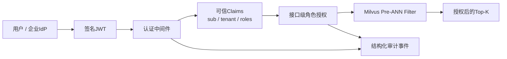

# 企业RAG身份、权限与审计闭环

## 1. 当前完成范围

项目已经从“客户端传Tenant/Role的权限演示”升级为可信身份闭环：



认证层抽象为统一`auth.Verifier`，有两种运行模式：

- 本地实验：服务端预定义Persona，HS256签发和验签；
- 企业接入：OIDC Discovery + JWKS + RS256验签，RAG服务不持有私钥。

OIDC模式固定接受`RS256`，根据`kid`选择公钥，缓存JWKS，并在遇到未知`kid`时限频刷新以支持密钥轮换。启动时预热Discovery/JWKS，身份平台不可用或没有可用Key时拒绝启动；运行时验签、Claims或刷新失败均Fail Closed。

## 2. OIDC生产配置

自动Discovery：

```bash
RAGLAB_AUTH_OIDC_ISSUER=https://id.example.com/realms/acme \
RAGLAB_AUTH_AUDIENCE=raglab-api \
go run ./cmd/raglab serve-lab
```

不能提供Discovery时，可显式配置JWKS：

```bash
RAGLAB_AUTH_OIDC_ISSUER=https://id.example.com/realms/acme \
RAGLAB_AUTH_JWKS_URL=https://id.example.com/realms/acme/protocol/openid-connect/certs \
RAGLAB_AUTH_AUDIENCE=raglab-api \
go run ./cmd/raglab serve-lab
```

OIDC模式开启后：

- `POST /api/v1/auth/dev-token`不会注册，避免生产环境自助提权；
- `GET /api/v1/auth/me`可用于验证当前Token映射结果；
- Discovery返回的Issuer必须与配置一致；
- Provider URL必须使用HTTPS，只有loopback开发地址允许HTTP；
- JWKS响应有大小上限，只接受至少2048 bit的RSA签名公钥；
- 未知`kid`允许一次主动刷新，随后短时间限频，避免攻击者制造JWKS请求风暴。

IdP需要把业务身份映射到Access Token：

| Claim | 要求 | 用途 |
|---|---|---|
| `sub` | 必填 | 用户稳定标识 |
| `tenant_id` | 必填 | 租户数据边界 |
| `roles` | 必填其一 | `viewer`、`admin`、`platform_admin` |
| `realm_access.roles` | Keycloak兼容 | 与顶层`roles`合并去重 |
| `iss`、`aud`、`exp` | 必填 | Token归属、目标服务和有效期 |
| `iat`、`nbf` | 可选但建议 | 签发时间与生效时间 |

这里验证的是Resource Server一侧的Bearer Token。浏览器生产登录仍应由网关或前端使用Authorization Code + PKCE完成；本项目不把本地Persona页面宣称为企业SSO登录页。

## 3. 信任边界

### 不可信输入

- 浏览器提交的`tenant_id`；
- 浏览器提交的`user_role`；
- Query文本、Product、Version和Top-K；
- 未签名或签名错误的Token。

### 可信输入

- JWT验签成功后的`sub`；
- JWT中的`tenant_id`；
- JWT中的`roles`；
- 服务端配置的Issuer和Audience。

普通Milvus搜索即使在Body中提交：

```json
{
  "tenant_id": "tenant_evil",
  "user_role": "platform_admin"
}
```

服务端也会覆盖为已验签Claims中的Tenant和Role。客户端不能通过修改请求获得更高权限。

## 4. 授权规则

| 场景 | 允许角色 | Milvus Filter |
|---|---|---|
| Public Active | 所有已认证用户 | `visibility == "public" and status == "active"` |
| Tenant Admin Active | 当前Tenant的Admin | Public，或同时匹配Tenant与Admin Role |
| Active All | Platform Admin | `status == "active"` |
| 全局审计日志 | Platform Admin | 不适用 |

Tenant和Role缺失时不会回退为更宽权限。Viewer调用Admin场景返回`403 Forbidden`，请求不会发送到Milvus。

## 5. 审计事件

认证中间件为每次受保护请求生成`X-Request-ID`并记录：

- 时间；
- Subject、Tenant、Roles；
- Method和Path；
- Allowed / Denied；
- HTTP Status；
- Duration；
- 认证失败原因。

本地Lab使用有容量上限的内存审计日志，避免无界增长。`GET /api/v1/audit/recent`只允许Platform Admin访问。

生产环境应将同一事件接口替换为异步持久化Sink，例如Kafka + ClickHouse/Elasticsearch，并增加数据保留、脱敏和告警策略。

## 6. 本地身份体验

`POST /api/v1/auth/dev-token`只允许签发服务端预定义Persona：

- `public_viewer`
- `tenant037_viewer`
- `tenant037_admin`
- `platform_admin`

不能提交任意Tenant或Role。本接口仅用于本地实验，不应暴露在生产部署。

网页的`100K Lab`可以切换Persona，观察：

1. 未登录请求返回401；
2. Viewer访问Admin场景返回403；
3. Tenant Admin生成绑定当前Tenant的Milvus Filter；
4. Platform Admin可以运行全局场景并读取审计事件；
5. 每次成功或拒绝请求都有Request ID。

## 7. 已覆盖安全测试

- 篡改JWT签名后拒绝；
- 过期Token拒绝；
- Issuer/Audience不匹配拒绝；
- HS256/`none`等算法混淆拒绝；
- OIDC Discovery与JWKS缓存；
- Audience字符串和数组两种格式；
- 未知`kid`刷新后接受轮换Key；
- 未知`kid`刷新限频和Provider不可用时Fail Closed；
- 非HTTPS远端Provider配置拒绝；
- OIDC生产模式不暴露本地Token签发路由；
- 无Token的受保护搜索返回401；
- Body伪造Tenant和Role无效；
- Viewer调用Tenant Admin场景返回403；
- 被拒绝的请求没有到达Milvus；
- ACL Hard Negative保持0次越权召回；
- CORS只允许localhost开发Origin，并显式允许Authorization Header。

## 8. 企业化后续阶段

### 已完成：身份接入

- OIDC Discovery与JWKS缓存/轮换；
- 统一Verifier边界与生产模式关闭Dev Issuer；
- Issuer/Audience/时间窗口/算法/Key强度校验；
- 服务启动预热与请求Fail Closed。

对接具体Keycloak、Auth0或企业统一身份平台时，只需完成Client、Audience和自定义Claims Mapper配置；不同组织/知识库Scope映射属于业务授权模型，不应写死在Token解析器中。

### P1：身份治理

- Token撤销与短期Access Token；
- 用户、组织、项目和知识库Scope映射。

### P2：数据生命周期

- [x] 增量Upsert/Delete与删除后Strong Query验证；
- [x] Event ID幂等、Revision乱序门禁与删除Tombstone；
- [x] Embedding版本混写门禁；
- Outbox与幂等消费；
- [x] Active Collection Alias创建与Alias检索；
- Collection Alias蓝绿发布、原子晋升与回滚；
- 文档在缓存、关键词索引、对象存储和备份中的协同清除。

### P3：生产可靠性

- Rate Limit、并发隔离和Tenant配额；
- Redis语义缓存及权限参与Cache Key；
- Timeout、Retry、Circuit Breaker和降级；
- OpenTelemetry、Prometheus和结构化Trace；
- 持久化审计与安全告警。

### P4：质量运营

- 离线Golden Dataset与在线反馈闭环；
- 按Tenant、Query类型和Filter选择性分桶评测；
- Prompt Injection、数据投毒和越权红队集；
- Canary索引与自动回滚门禁。

当前版本已经具备“企业IdP签发Token → OIDC/JWKS验签 → 可信Claims → 接口授权 → Milvus Pre-ANN ACL → Request ID审计”的纵向证据链，但不把Resource Server验签、内存审计或本地Persona夸大为完整企业IAM。

## 9. 身份绑定的生产门禁

身份 Token 只证明 Subject、Tenant 和声明的角色来自可信签发方，不自动授予数据库权限。PostgreSQL `EnsureIdentity` 现在是只读校验：租户、用户、Membership 必须都处于 active，且数据库角色必须出现在当前 Token 的角色集合中。新用户或角色变更必须通过显式 `ProvisionIdentity`/邀请流程完成；普通检索请求不会写入 Membership。

这条规则专门防止两类高风险问题：

1. 未邀请用户在 Token 中自带一个租户 Claim 后自助获得 tenant access；
2. admin 被 IdP 降级为 viewer 后，继续复用数据库中旧的 admin Membership。

本地 Demo 的账号预置仍然存在，但它在启动时显式 Provision；OIDC 模式不注册本地账号、登录和 Dev Token。生产启动建议设置 `RAGLAB_REQUIRE_OIDC=true`，由 [production_preflight.sh](../scripts/production_preflight.sh) 检查 OIDC、TLS 数据库连接、非默认凭据、Redis 共享限流和 Milvus 主机暴露面。
