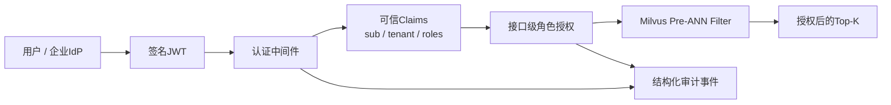

# 企业RAG身份、权限与审计闭环

## 1. 当前完成范围

项目已经从“客户端传Tenant/Role的权限演示”升级为可信身份闭环：



当前本地Lab使用HS256签名JWT，校验：

- 签名；
- 固定算法，拒绝算法降级；
- Issuer；
- Audience；
- Expiration与Issued At；
- Subject、Tenant和Roles完整性。

生产环境应把本地签发端替换为企业OIDC Provider，并使用JWKS/RS256完成密钥轮换；RAG服务仍复用相同的可信Claims和授权接口。

## 2. 信任边界

### 不可信输入

- 浏览器提交的`tenant_id`；
- 浏览器提交的`user_role`；
- Query文本、Product、Version和Top-K；
- 未签名或签名错误的Token。

### 可信输入

- JWT验签成功后的`sub`；
- JWT中的`tenant_id`；
- JWT中的`roles`；
- 服务端配置的Issuer和Audience。

普通Milvus搜索即使在Body中提交：

```json
{
  "tenant_id": "tenant_evil",
  "user_role": "platform_admin"
}
```

服务端也会覆盖为已验签Claims中的Tenant和Role。客户端不能通过修改请求获得更高权限。

## 3. 授权规则

| 场景 | 允许角色 | Milvus Filter |
|---|---|---|
| Public Active | 所有已认证用户 | `visibility == "public" and status == "active"` |
| Tenant Admin Active | 当前Tenant的Admin | Public，或同时匹配Tenant与Admin Role |
| Active All | Platform Admin | `status == "active"` |
| 全局审计日志 | Platform Admin | 不适用 |

Tenant和Role缺失时不会回退为更宽权限。Viewer调用Admin场景返回`403 Forbidden`，请求不会发送到Milvus。

## 4. 审计事件

认证中间件为每次受保护请求生成`X-Request-ID`并记录：

- 时间；
- Subject、Tenant、Roles；
- Method和Path；
- Allowed / Denied；
- HTTP Status；
- Duration；
- 认证失败原因。

本地Lab使用有容量上限的内存审计日志，避免无界增长。`GET /api/v1/audit/recent`只允许Platform Admin访问。

生产环境应将同一事件接口替换为异步持久化Sink，例如Kafka + ClickHouse/Elasticsearch，并增加数据保留、脱敏和告警策略。

## 5. 本地身份体验

`POST /api/v1/auth/dev-token`只允许签发服务端预定义Persona：

- `public_viewer`
- `tenant037_viewer`
- `tenant037_admin`
- `platform_admin`

不能提交任意Tenant或Role。本接口仅用于本地实验，不应暴露在生产部署。

网页的`100K Lab`可以切换Persona，观察：

1. 未登录请求返回401；
2. Viewer访问Admin场景返回403；
3. Tenant Admin生成绑定当前Tenant的Milvus Filter；
4. Platform Admin可以运行全局场景并读取审计事件；
5. 每次成功或拒绝请求都有Request ID。

## 6. 已覆盖安全测试

- 篡改JWT签名后拒绝；
- 过期Token拒绝；
- Issuer/Audience不匹配拒绝；
- 无Token的受保护搜索返回401；
- Body伪造Tenant和Role无效；
- Viewer调用Tenant Admin场景返回403；
- 被拒绝的请求没有到达Milvus；
- ACL Hard Negative保持0次越权召回；
- CORS只允许localhost开发Origin，并显式允许Authorization Header。

## 7. 企业化后续阶段

### P1：身份接入

- OIDC Discovery与JWKS缓存/轮换；
- 对接Keycloak、Auth0或企业统一身份平台；
- Token撤销与短期Access Token；
- 用户、组织、项目和知识库Scope映射。

### P2：数据生命周期

- 增量Upsert/Delete；
- Outbox与幂等消费；
- Collection Alias蓝绿切换；
- Embedding版本与索引版本一致性；
- 文档删除后的可验证清除。

### P3：生产可靠性

- Rate Limit、并发隔离和Tenant配额；
- Redis语义缓存及权限参与Cache Key；
- Timeout、Retry、Circuit Breaker和降级；
- OpenTelemetry、Prometheus和结构化Trace；
- 持久化审计与安全告警。

### P4：质量运营

- 离线Golden Dataset与在线反馈闭环；
- 按Tenant、Query类型和Filter选择性分桶评测；
- Prompt Injection、数据投毒和越权红队集；
- Canary索引与自动回滚门禁。

当前版本已经具备企业RAG最关键的“可信身份不能被客户端伪造、权限在ANN之前执行、每次决策可审计”纵向证据链，但不把本地JWT签发与内存审计夸大为完整生产IAM。
