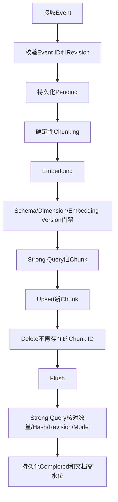

# 企业RAG增量索引与删除一致性

## 1. 为什么不能继续使用Seed

`milvus-seed`通过Drop/Recreate建立可复现实验基线，适合本地初始化，但不适合生产：

- 全量重建期间可能没有可服务索引；
- 文档更新后，旧Chunk可能继续被召回；
- 删除操作没有可验证的完成语义；
- 重复消息和乱序消息可能覆盖新知识；
- 更换Embedding模型后可能把两个向量空间写进同一个Collection。

生命周期服务使用独立的`raglab_lifecycle_v1`物理Collection和`raglab_knowledge_active`服务Alias，不影响原有语料和100K压测Collection。

## 2. 变更协议

每个事件必须携带：

```json
{
  "event_id": "kb-identity-1042-r7",
  "operation": "upsert",
  "source_revision": 7,
  "document": {
    "document_id": "kb-identity-1042",
    "title": "企业登录",
    "content": "# 新入口\n\n入口迁移到身份中心。",
    "product": "identity",
    "version": "2.0",
    "status": "active",
    "visibility": "public"
  }
}
```

- `event_id`：消息幂等键。同一Payload重复投递直接返回第一次结果；相同ID配不同Payload返回冲突。
- `source_revision`：文档源系统的单调递增版本。小于高水位的事件返回`409 Conflict`。
- `document_id`：业务稳定主键。
- `chunk_id`：由`document_id + sequence`确定性生成，重复Upsert覆盖同一实体。

事件先以`pending`状态原子写入本地状态文件，再操作Milvus，最后标记`completed`。如果进程在Milvus变更后、状态提交前退出，重投同一事件会再次执行幂等Upsert/Delete并完成提交。Pending需要保留Payload用于重放；Completed只保留Payload Hash、文档ID、Revision和结果回执，避免账本长期复制知识正文。

## 3. Upsert算法



新Chunk先Upsert，陈旧Chunk后删除，避免先删除整篇文档造成明显空窗。更新后的验证不只比较数量，还核对：

- `content_hash`
- `source_revision`
- `embedding_model`
- `embedding_version`
- 新Chunk集合中不存在旧Chunk ID

## 4. Delete算法

删除不是“请求发出即成功”：

1. Strong Query记录删除前Chunk集合；
2. 通过`document_id`执行Milvus Delete；
3. Flush；
4. 再次Strong Query；
5. 只有结果为0才提交删除完成状态；
6. 保存文档Revision Tombstone，旧事件不能把文档复活。

网页执行Delete后，再用Active Alias搜索相同问题，应得到0个结果。

## 5. Embedding版本门禁

Collection新增以下元数据：

| 字段 | 用途 |
|---|---|
| `content_hash` | 验证内容与向量写入对应 |
| `embedding_model` | 模型实现标识 |
| `embedding_version` | 不可变构建版本 |
| `document_version` | 业务文档版本 |
| `source_revision` | 乱序事件门禁 |
| `indexed_at` | 索引写入时间 |

每次增量写入都会检查Collection Schema、向量维度，并抽样检查现有数据的模型与Embedding版本。版本不同会Fail Closed，提示新建Collection并使用Alias切换，禁止静默混写。

Milvus Client已经支持：

- `POST /v2/vectordb/entities/query`
- `POST /v2/vectordb/entities/delete`
- `POST /v2/vectordb/aliases/create`
- `POST /v2/vectordb/aliases/alter`

当前首个生命周期Collection自动创建Active Alias。下一阶段会把“全量回填新Collection → 行数/索引/质量门禁 → Alter Alias → 回滚”封装成独立发布流程。

## 6. 权限和接口

生命周期管理接口只允许`platform_admin`：

```text
GET  /api/v1/milvus/lifecycle/status
POST /api/v1/milvus/lifecycle/apply
```

检索仍允许普通已认证用户，但Tenant和Role只取验签Claims：

```text
POST /api/v1/milvus/lifecycle/search
```

检索Filter额外绑定当前`embedding_model + embedding_version`，并继续执行Public/Tenant/Role/Status Pre-ANN ACL。

## 7. 真实Milvus验证

本机Milvus 2.6.20与Qwen3-Embedding-4B完成了以下验证：

| 步骤 | 结果 |
|---|---|
| Revision 1 Upsert | 0 → 2 Chunks，Post-Mutation Verified |
| Active Alias Search | 返回2个旧版Chunk |
| Revision 2 Upsert | 2 → 1 Chunk，删除1个陈旧Chunk |
| 再次Alias Search | 只返回新版“身份中心”内容 |
| Revision 3 Delete | 1 → 0 Chunk，Post-Mutation Verified |
| 删除后Alias Search | 0 Hits |
| 重投Revision 3 | `duplicate=true`，没有再次修改Milvus |
| 投递旧Revision 2 | HTTP 409，拒绝乱序事件 |
| Ledger状态 | 3 Events，0 Pending，Document Tombstone Revision 3 |

## 8. 仍然需要明确的生产边界

本地原子JSON状态文件用于把幂等、Pending重放和Revision高水位讲清楚，不冒充分布式事务。生产实现应替换为：

- PostgreSQL业务表 + Outbox同事务提交；
- Kafka按`document_id`分区，保持单文档顺序；
- 消费者Inbox/幂等表；
- Pending事件超时扫描与重放；
- Dead Letter Queue和人工修复；
- 文档源状态与向量状态对账；
- 删除后的对象存储、缓存、BM25索引和备份协同清除。

Milvus不是事实源。事实源、Outbox和文档Revision决定“应该是什么”，Milvus负责“当前可检索副本是什么”，对账任务负责发现两者偏差。
