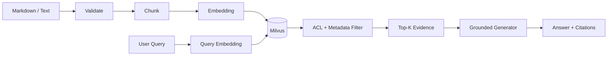

# RAG 主流程体验指南

这份指南只覆盖项目最重要的一条链路：资料进入知识库后，经过切分、Embedding、Milvus 检索和生成模型回答，并在网页中展示证据与引用。Redis、Collector、索引灰度等运行面能力不影响这条主流程，可以暂时不关注。

## 1. 启动

```bash
cp .env.example .env
make stack-up
```

默认档位使用确定性 Hash Embedding 和抽取式回答，适合先验证链路。要体验真实模型，在 `.env` 中切换：

```dotenv
RAGLAB_EMBEDDING_BACKEND=ollama
RAGLAB_OLLAMA_MODEL=qwen3-embedding:4b-local
RAGLAB_GENERATION_PROVIDER=deepseek
RAGLAB_GENERATION_API_KEY=你的token
RAGLAB_GENERATION_MODEL=deepseek-chat
```

打开 <http://localhost:3000/portal>，登录页提供三个本地演示账号。推荐先使用 `alice@tenant-a.local` 验证租户知识库。

## 2. 网页主流程

1. 在“知识库”确认当前身份可见的知识空间。
2. 在“导入资料”选择 Markdown/纯文本文件，或直接粘贴正文；确认文档 ID、版本和源修订号后提交。
3. 在导入任务面板观察 `VALIDATE → CHUNK → EMBED → INDEX → VERIFY`，任务完成后回到“企业 Agent 工作台”。
4. 选择刚才的知识库，点击示例问题或直接提问。回答完成后，右侧会自动展示本次召回的 chunks、相似度、过滤条件和来源引用。
5. 点击“只看检索”可以单独观察召回质量，不经过生成模型。

导入页还提供“预览分块”：在写入 Embedding/Milvus 之前检查 page marker、heading path、Parent/Child 关系和 overlap。详细格式见 [`structured-chunk-preview.md`](structured-chunk-preview.md)。

核心链路如下：



## 3. 必须验证的四个问题

| 场景 | 预期现象 | 说明 |
|---|---|---|
| 正常问题 | 有回答、有引用、右侧出现召回证据 | 验证主流程闭环 |
| 无关问题 | 返回“没有足够证据”或拒答 | 验证不会凭空补全 |
| Tenant A 导入后用 Tenant B 查询 | B 看不到 A 的资料 | 验证服务端 ACL 和 Milvus Filter |
| 同一文档重复导入相同修订号 | 返回幂等结果，不产生重复 Chunk | 验证增量写入一致性 |

## 4. 直接 API 验证

登录获取 Token 后，可以用最小接口验证，不依赖门户：

```bash
TOKEN=$(curl -s http://localhost:8080/api/v1/auth/login \
  -H 'content-type: application/json' \
  -d '{"email":"alice@tenant-a.local","password":"RagLab-Alice-2026!"}' \
  | jq -r .access_token)

curl -s http://localhost:8080/api/v1/datasets \
  -H "Authorization: Bearer $TOKEN" | jq .datasets

curl -s -N http://localhost:8080/api/v1/datasets/tenant-a-operations/answer/stream \
  -H "Authorization: Bearer $TOKEN" \
  -H 'content-type: application/json' \
  -d '{"query":"如何申请企业单点登录？","top_k":5}'
```

## 5. 主流程完成标准

- 能导入一份真实 Markdown/文本资料，并在任务面板看到完成状态。
- 检索结果能展示 chunk 内容、距离和过滤表达式。
- 生成回答只能引用最终召回证据；证据不足时拒答。
- 前端流式显示回答，完成后自动回填本次召回证据。
- Tenant A/B 使用不同账号验证数据隔离。
- Golden Query 回归保持通过，再讨论 Rerank、Query Rewrite 或规模扩展。

当前演示版支持 Markdown 和纯文本；PDF、表格、OCR 等解析能力应在主流程稳定后单独增加，不放在当前核心验收之前。
